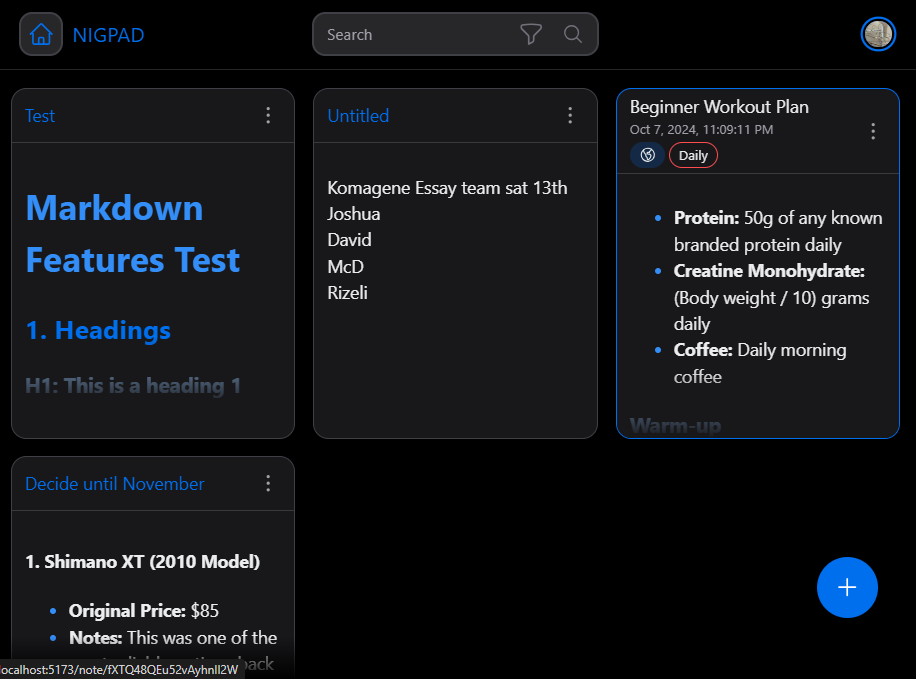

# NIGPAD
Simple Note taking webapp. Uses Browser's storage.

 [Try here online](https://nigpad.netlify.app/)

## Roadmap
- 
    - [ ] Add folder organization
    - [x] Implement search functionality
    - [ ] Sort search results (e.g. lastUpdated)
    - [ ] Support markdown/rich formatting
    - [x] Introduce a tagging system (wip)  
    - [ ] Add dark mode toggle
    - [ ] Implement cloud sync (Firebase)
    - [ ] Cloud account customization
    - [ ] Make public notes
    - [ ] Simple NoteCard customization
